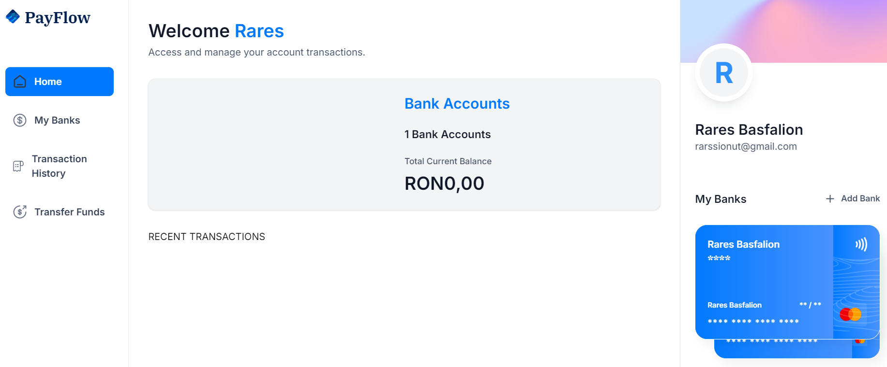
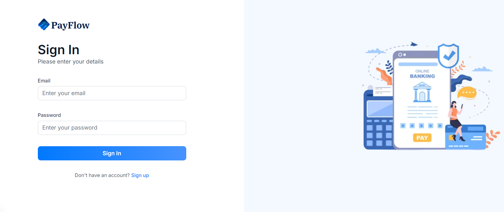
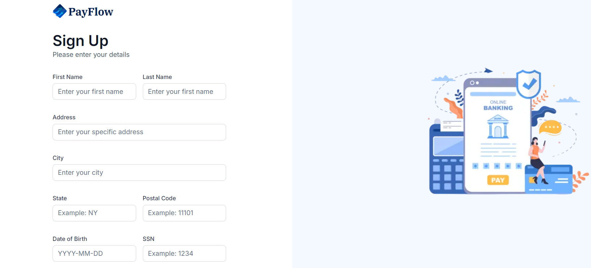
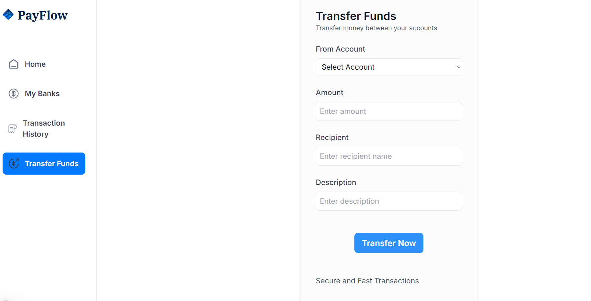
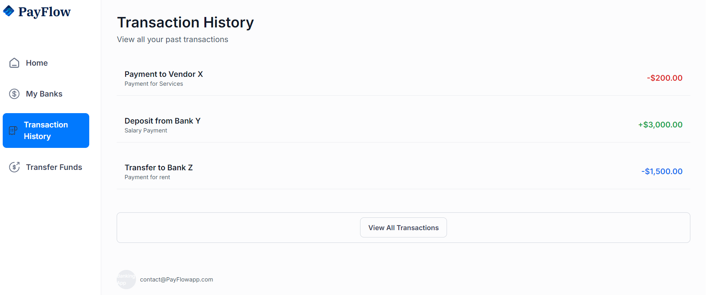
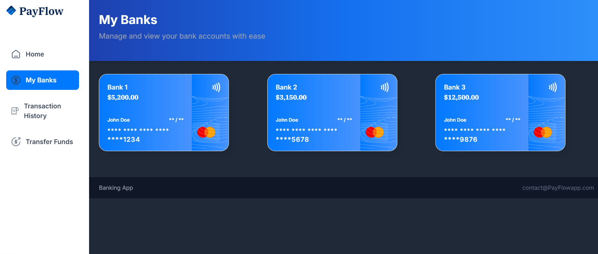

<!-- Project Header -->

    <h1>💸 PayFlow</h1>
    

<!-- Project Description -->
<h3 align="left">📌 About PayFlow</h3>

    <b>PayFlow</b> is a practice project focused on integrating a backend database with <b>Appwrite</b> and exploring frontend development using <b>React, ShadCN UI, and Next.js</b>.  
    While it doesn't have fully functional features yet, it serves as an experimental space for learning backend connectivity and frontend UI improvements.

<!-- Technologies Used -->
<h3 align="left">🛠️ Tech Stack</h3>
<ul align="left">
    <li>🖥️ <b>Frontend:</b> React, Next.js, ShadCN UI</li>
    <li>🗄️ <b>Backend:</b> Appwrite (Database, Authentication, APIs)</li>
    <li>⚙️ <b>Development:</b> TypeScript, Tailwind CSS</li>
</ul>

<!-- Installation -->
<h3 align="left">⚙️ Setup & Installation</h3>
<ol align="left">
    <li>Clone the repository:  
        <pre><code>git clone https://github.com/qpakashi/payflow.git</code></pre>
    </li>
    <li>Navigate to the project folder:
        <pre><code>cd payflow</code></pre>
    </li>
    <li>Install dependencies:
        <pre><code>npm install</code></pre>
    </li>
    <li>Start the development server:
        <pre><code>npm run dev</code></pre>
    </li>
</ol>

<!-- Features -->
<h3 align="left">🚀 Features</h3>
<ul align="left">
    <li>✅ Backend database connection using <b>Appwrite</b></li>
    <li>🎨 Frontend UI components styled with <b>ShadCN UI</b></li>
    <li>⚡ Learning-focused project for <b>Next.js</b> and modern frontend frameworks</li>
</ul>

<!-- Screenshots -->
<h3 align="left">📸 Screenshots</h3>

    
     
    <i>Main Page</i>

    
     
    <i>Login Page</i>

    
     
    <i>Sign Up</i>

    
     
    <i>Transfer Funds</i>

    
     
    <i>Transaction List</i>

    
     
    <i>Credit Cards Connected</i>

<!-- Future Improvements -->
<h3 align="left">🔮 Future Improvements</h3>
<ul align="left">
    <li>💳 Implement authentication and user management</li>
    <li>📊 Add transaction tracking features</li>
    <li>📱 Improve UI responsiveness</li>
</ul>

<!-- Contact -->
<h3 align="left">📫 Contact</h3>

    
    

</body>
</html>
